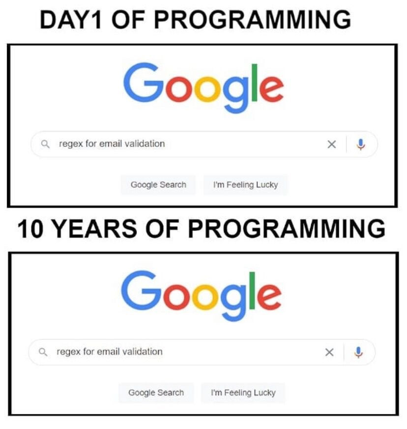
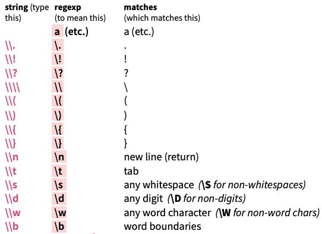
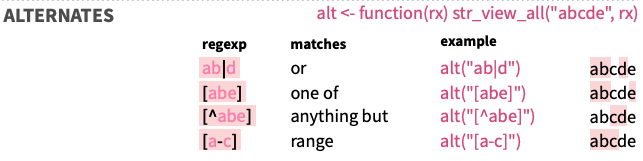
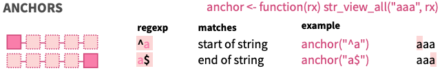
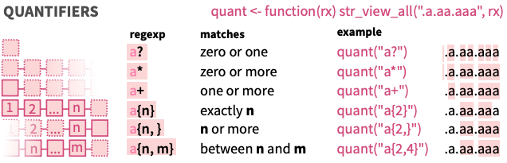

```{r setup, include=FALSE}
options(htmltools.dir.version = FALSE)
```
# Before we start...

- We commit to adhering to the [RLadies Global Code of Conduct](https://rladies.org/code-of-conduct/)

- Be respectful and kind, everyone is welcome here.


---
class: center, middle
# Welcome!

Introduction to Regular Expressions

*Breakout: crossword*

Plenary discussion

*Breakout: script*

Discussion & closing

---
class: inverse, center, middle

# Introduction to Regular Expressions

---
# What are Regular Expressions?

- A way to detect text based on character patterns

- A convention to describe such a pattern

- Often abbreviated to 'RegEx'

- Extremely powerful, but confusing to parse (for a human)


---
```{r, echo=FALSE, eval=TRUE, out.width=600}
knitr::include_graphics("regex_utrecht_files/figure-html/regular_expressions_xkcd.png")
```
Source: [xkcd](https://xkcd.com/208/)


---
# For example: an email address

```
(?:[a-z0-9!#$%&'*+/=?^_`{|}~-]+(?:\.[a-z0-9!#$%&'*+/=?^_`{|}
~-]+)*|"(?:[\x01-\x08\x0b\x0c\x0e-\x1f\x21\x23-\x5b\x5d-\x7f]
|\\[\x01-\x09\x0b\x0c\x0e-\x7f])*")@(?:(?:[a-z0-9](?:[a-z0-9-
]*[a-z0-9])?\.)+[a-z0-9](?:[a-z0-9-]*[a-z0-9])?|\[(?:(?:25[0-
5]|2[0-4][0-9]|[01]?[0-9][0-9]?)\.){3}(?:25[0-5]|2[0-4][0-9]|
[01]?[0-9][0-9]?|[a-z0-9-]*[a-z0-9]:(?:[\x01-\x08\x0b\x0c\x0e
-\x1f\x21-\x5a\x53-\x7f]|\\[\x01-\x09\x0b\x0c\x0e-\x7f])+)\])
```
via [emailregex.com](http://emailregex.com/)

---
```{r, echo=FALSE, eval=TRUE, out.width=600}

```

---
# Elements of a Regular Expression

**What characters** am I looking for?

- character types (e.g.: capitals, digits, spaces, punctuation...)
- specified sets of characters (e.g. only A, B, or C; anything but 8 ...)

--

**How many** do I need?

- a specified numner (e.g. exactly 4)
- a specific range (e.g.: more than once, any number of times ...)

--

What is their **context**?

- anchored as the beginning or end of a string
- preceded or followed by another pattern

---
# Interlude: RegEx in R

- There are several libraries and functions that can parse regex in R, e.g.:

  - base R functions `grep` and associates (`?grep` gets you a collection)
  - tidyverse package `stringr` parses regex and has several additional tools
  
--

- This presentation will use mostly `stringr` functions:

  - Tidyverse packages are solid, sophisticated, and community supported
  - additional `stringr` tools makes regex more accessible
  - it comes with a fabulous [cheatsheet](https://github.com/rstudio/cheatsheets/raw/master/strings.pdf)

--

- Take away: there is more to regex in R than `stringr` :)

---
# In practice

Let's start with a string:
```{r}
example <- "This afternoon, I ate 24 apples. Now I have a stomach ache."
```

--

I want to find the word "apple". I can simply use the following expression:
```{r}
pattern <- "apple"
```

--

Let's find the pattern in the sentence:

```{r}
library(stringr)
str_extract(example, pattern)
```


---
# In practice

What if I don't know what fruit I ate?

```{r}
fruits <- "grape|pear|apple|strawberry|pineapple|blackberry|banana"

str_extract(example, pattern)
```

** We separate alternatives with the pipe character `|`. **

---
# In practice

How do I find out how many fruits I ate?

Let's look for a digit. We can use `\\d`:
```{r}
str_extract(example, "\\d")
```

--

Or use the `stringr`-tool `[:digit:]`:

```{r}
str_extract(example, "[:digit:]")
```

--

Wait -- didn't I eat many more? What is wrong here?

--

```{r}
str_extract(example, "\\d+")
```

The + is used to denote *one or more* of the previous character.
---
# In practice

Let's extract both the quantity and the fruit (or whatever object I counted)

```{r}
pattern <- "\\d+\\s\\w+"

str_extract(example, pattern)
```

--

With meta-characters I can easily search for pre-defined sets of characters:

- `.` matches ANY character except the newline character `\n`
- `\d` matches digits 0 through 9
- `\w` matches alphanumeric characters and underscores
- `\s` matches any whitespace
- `\t` matches tabs specifically
- `\n` matches a newline

---
# Escaping

- You may have noticed I used `\\d` and not `\d` (the actual regex).

--

- This is because some characters, such as `\` cannot be used directly in an r string:
  ```{r, error=T}
  writeLines("a back\slash is not accepted just like that")
  ```

--

- These characters need to be 'escaped', using the special character `\`:
  ```{r}
  writeLines("but a back\\slash can be escaped like this!")
  ```

--

- So, to make the regex `\d`, I use an extra `\` so that it can be correctly parsed!

--

- Note that some characters need to be *doubly* escaped to match them: `\\{` will match the character `{` in a string.

---
# Special characters

From the [stringr cheatsheet](https://github.com/rstudio/cheatsheets/raw/master/strings.pdf):

```{r, echo=FALSE, eval=TRUE, out.width=600}

```

---
# In practice

```{r, include=F}
names <- read.csv("regex_utrecht_files/fictionalnames.csv")
names <- names$Name
```
I have a vector of names (generated with [listofrandomnames.com](http://www.listofrandomnames.com/index.cfm?textarea)).

I want to select names that start with a C, then a vowel:
```{r}
pattern <- "C[aeiou]"

grep(pattern, names, value = T)
```

--

How about a C, followed by a consonant:
```{r}
pattern <- "C[^aeiou]"

grep(pattern, names, value = T)
```

--

**Note that I am using a different function, `grep()`. This function selects elements in a list based on a regex match, and returns the entire element!**
---
# In practice

Let's find names where only the first name starts with a C:

```{r}
pattern <- "^C"

grep(pattern, names, value = T)
```

--

Or where both names start with a C:

```{r}
pattern <- "^C.+C"

grep(pattern, names, value = T)
```

---
# There are so many more options!

Here are a few:

```{r, echo=FALSE, eval=TRUE, out.width=600}

```

```{r, echo=FALSE, eval=TRUE, out.width=600}

```

---
# There are so many more options!

```{r, echo=FALSE, eval=TRUE, out.width=600}

```

These are screenshots from the much-recommended [stringr cheatsheet](https://github.com/rstudio/cheatsheets/raw/master/strings.pdf).

---
# Why would you use regular expressions?

- Efficiently searching for a variety of patterns.

- Decisions and actions based on matches:

  - Replace your match with something else:
  ```{r}
  pattern <- "^C.+C.+"
  str_replace(names, pattern, "Babcock!") %>% head()
  ```
--
  
  - Use detection in an if-statement, and e.g. search for further information
  ```{r}
  str_detect(names, pattern) %>% head()
  ```  

---
# Why would you use regular expressions?

- My personal use:

  - Find a DOI in a pdf, and use it to find reference information for my database
  
  - Look for a specific amino acid pattern in a protein sequence

--

How about you?

---
# A note of caution

- Your regex may match unexpected things!

  - Make a positive and negative test set (what do you want to match, what *don't* you want to match) when developing one.
  
  - Make your test set as large as possible: realities of the test set translate to assumptions in your pattern.

```{r, echo=FALSE, eval=TRUE, out.width=600}
knitr::include_graphics("regex_utrecht_files/figure-html/regular_expressions_xkcd_problem.png")
```

Source: [xkcd](https://xkcd.com/1171/)

---
class: inverse, center, middle

# Thank you!